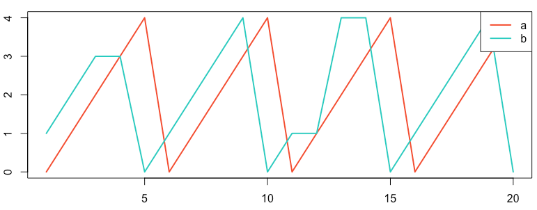
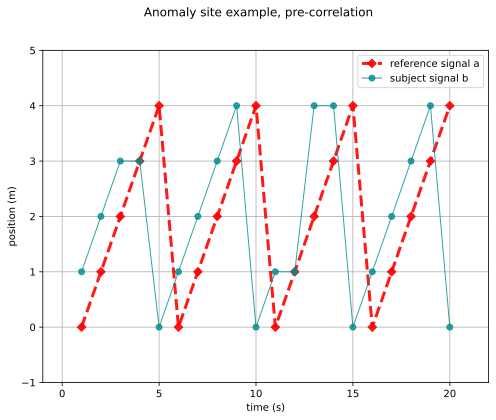
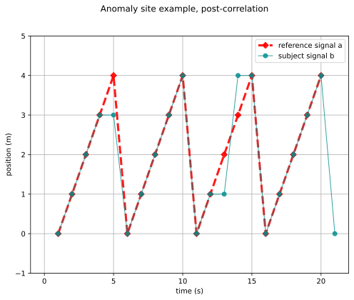

# Cross-Correlation

Cross-correlation is a measure of similarity between two series, typically a time series.
It is sometimes called the *sliding dot product* or *sliding inner product*.

The cross-correlation implements the following conceptual steps:

* Given two signals
  * $r(t)$ is the **reference** signal with bounds $[r_a, r_b]$.
  * $s(t)$ is the **subject** signal with bounds $[s_a, s_b]$.
* Synchronization:
  * Find the global minimum $T_a = \min(r_a, s_a)$.
  * Find the global maximum $T_b = \max(r_b, s_b)$.
  * Construct a global time interval $[T_a, T_b]$.
  * Choose a global time step, $\Delta T$, to be the minimum of the reference time step and the subject time step. 
* Correlation:
  * Keep the reference signal stationary.  Move the subject signal along the $t$ axis until the last data point of the subject signal is multiplied with the first data point of the reference signal.
  * Then, slide the subject signal to the right on the $t$ axis by $\Delta T$, calculating the inner product of the two signals for each $\Delta T$ in $[T_a, T_b]$.
  * Find the largest value of the foregoing inner products, and then for that $\Delta T$ step, move the subject curve to align with the reference curve.  This will represent the highest correlation between the reference and the signal.

The `figio` implementation is based on the formulations contained in
Terpsma *et al.*[^Terpsma_2020], Sections E.2 and E.3 (pages 110 to 121).

## Example

Consider the sawtooth examples shown below, recreated from the [Anomaly webpage](https://anomaly.io/understand-auto-cross-correlation-normalized-shift/), section *Normalized Cross-Correlation with Time Shift*.[^Anomaly_2016]



Figure: Reproduction of the sawtooth series on the Anomaly website.[^Anomaly_2016]

Create the input file [anomaly_recipe.yml](anomaly_recipe.yml)

```yml
<!-- cmdrun more anommaly_recipe.yml -->
```

which makes use of the two data series [signal_a.csv](signal_a.csv) and [signal_b.csv](signal_b.csv).

```sh
<!-- cmdrun more signal_a.csv -->
```

```sh
<!-- cmdrun more signal_b.csv -->
```

### Results

Run figio on the input file to produce the figures.

```sh
figio anomaly_receipe.yml

<!-- cmdrun figio anomaly_recipe.yml -->
```




Error metrics:

* cross-correlation relative error: `2.5 percent`
* L2-norm error rate: `8.3 percent`

## References

[^Terpsma_2020]: Terpsma RJ, Hovey CB. Blunt impact brain injury using cellular injury criterion. Sandia National Lab. (SNL-NM), Albuquerque, NM (United States); 2020 Oct 1. [link](https://www.osti.gov/servlets/purl/1716577)

[^Anomaly_2016]: Understanding Cross-Correlation, Auto-Correlation, Normalization and Time Shift, March 8, 2016.  Available from: [https://anomaly.io/understand-auto-cross-correlation-normalized-shift/](https://anomaly.io/understand-auto-cross-correlation-normalized-shift/)
