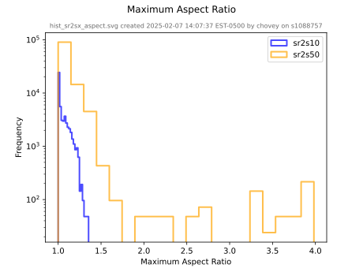
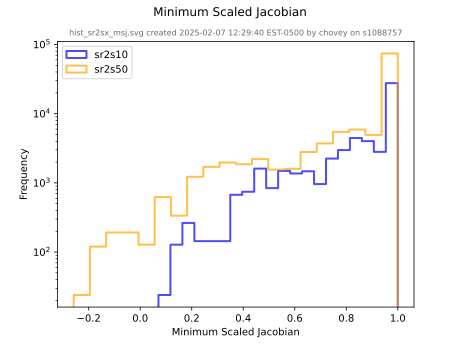
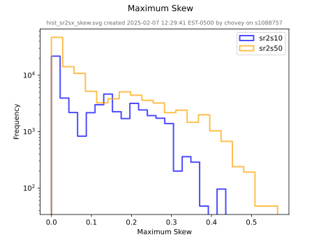
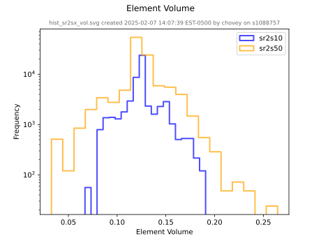

# Histograms

Given a particular column from a `csv` data source, `figio` can create a frequency count histogram.
We illustrate this functionality on a large data set called `sr2s10.csv` (5.4 MB) and `sr2s50.csv` (11 MB).
To reproduce this example, download the two data sets and place them in a local `~/temp` folder.

For concreteness in the following discussion, the first 10 rows of `sr2s10.csv` appear below:

```sh
  maximum edge ratio,    minimum scaled jacobian,               maximum skew,                     volume
          1.000000e0,                6.663165e-1,                2.872659e-1,                4.368155e-2
          1.193120e0,                6.478237e-1,                4.187394e-1,                8.360088e-2
          1.247881e0,                6.474025e-1,                4.065007e-1,                9.447332e-2
          1.214427e0,                6.549605e-1,                3.901043e-1,                8.909662e-2
          1.179123e0,                6.668604e-1,                3.859307e-1,                8.359763e-2
          1.171296e0,                6.702009e-1,                3.868204e-1,                8.222564e-2
          1.175480e0,                6.695364e-1,                3.874507e-1,                8.270613e-2
          1.178150e0,                6.694542e-1,                3.873941e-1,                8.308343e-2
```

To plot this data, we create a `yml` input file called [`histogram.yml`](histogram.yml).

```yml
<!-- cmdrun more histogram.yml -->
```

Run `figio` on the input file to produce the figures:

```sh
figio histogram.yml

<!-- cmdrun figio histogram.yml -->
```

The following figures appears:





