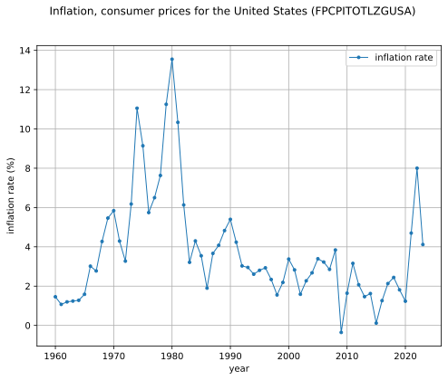

# Introduction

`figio` is Python application that uses declarative [`yml`](https://yaml.org)
input file recipies to produce high 
quality [*matplotlib*](https://matplotlib.org)
and $\LaTeX$ figures.

The following figure types are currently supported:
* `(x, y)` data (or, equivalently, time series data), and
* histogram data.

## Installation

Use of a [virtual environment](https://docs.python.org/3/library/venv.html)
is recommended but not necessary.

```sh
python -m venv .venv

# Activate the venv with one of the following:
source .venv/bin/activate       # for bash shell
source .venv/bin/activate.csh   # for c shell
source .venv/bin/activate.fish  # for fish shell
.\.venv\Scripts\activate        # for powershell
```

Install `figio` from the [Python Package Index (PyPI)](https://pypi.org/project/figio/).

```sh
pip install figio
```

## Getting Started

Tabular data is used as the data source of `figio` figures.
Let's get started with a tabular data for the inflation rate,
measured on the first day or each year.
The tabular data, [inflation.csv](inflation.csv), comes from the
[Federal Reserve Bank of St. Louis](https://fred.stlouisfed.org/series/FPCPITOTLZGUSA).

```sh
<!-- cmdrun more inflation.csv -->
```

To plot this data, we create a `yml` input file called
[`inflation.yml`](inflation.yml).

```yml
<!-- cmdrun more inflation.yml -->
```

Run `figio` on the input file to produce the figure:

```sh
figio inflation.yml

<!-- cmdrun figio inflation.yml -->
```

The following figure appears:



Congratulations!  You just make your first `figio` figure.
