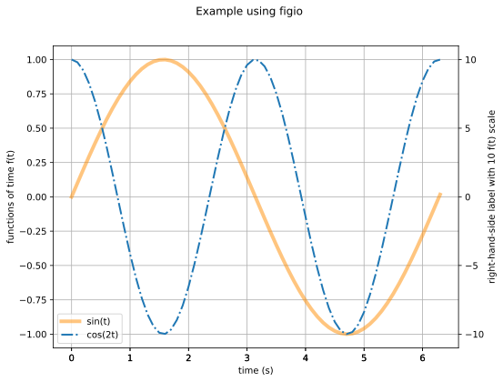

# Multiple Series

We show an examples of multiple series using default and non-default values for the line specifications (color, transparency, type).

The file [data.csv](data.csv)
contains colums for `time (s),sin(t),cos(2t)`.

```sh
<!-- cmdrun more data.csv -->
```

To plot this data, we create a `yml` input file called
[`recipe.yml`](recipe.yml).

```yml
<!-- cmdrun more recipe.yml -->
```

Run `figio` on the input file to produce the figure:

```sh
figio recipe.yml

<!-- cmdrun figio recipe.yml -->
```

The following figure appears:



Congratulations!  You just made a `figio` figure with two data sources.
