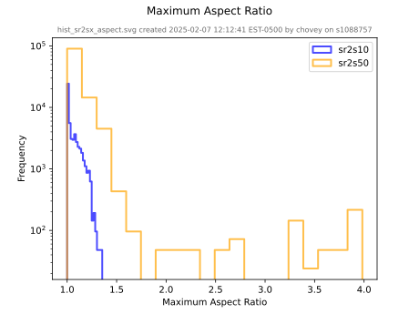
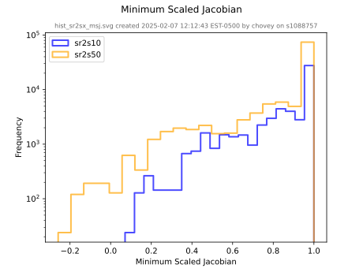
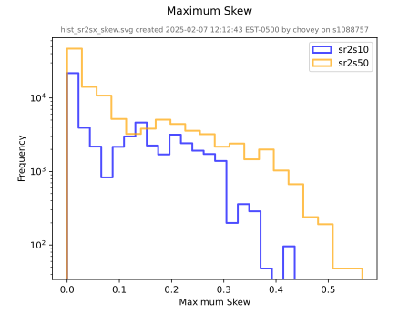
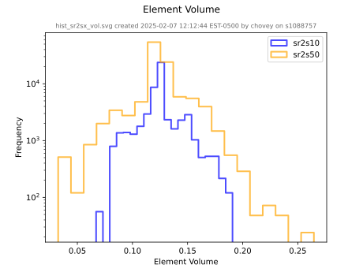
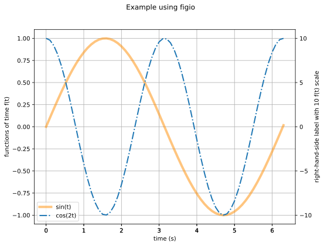
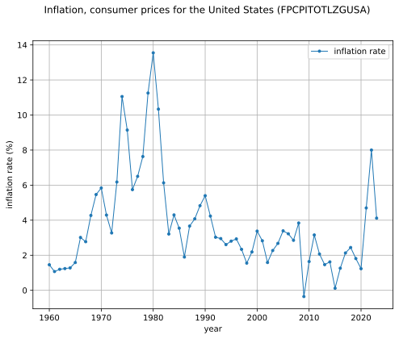

# Chapter 4: Histograms

Given a particular column from a `csv` data source, `figio` can create a frequency count histogram.
We illustrate this functionality on a large data set called `sr2s10.csv` (5.4 MB) and `sr2s50.csv` (11 MB).
To reproduce this example, download the two data sets and place them in a local `~/temp` folder.

For concreteness in the following discussion, the first 10 rows of `sr2s10.csv` appear below:

```sh
  maximum edge ratio,    minimum scaled jacobian,               maximum skew,                     volume
          1.000000e0,                6.663165e-1,                2.872659e-1,                4.368155e-2
          1.193120e0,                6.478237e-1,                4.187394e-1,                8.360088e-2
          1.247881e0,                6.474025e-1,                4.065007e-1,                9.447332e-2
          1.214427e0,                6.549605e-1,                3.901043e-1,                8.909662e-2
          1.179123e0,                6.668604e-1,                3.859307e-1,                8.359763e-2
          1.171296e0,                6.702009e-1,                3.868204e-1,                8.222564e-2
          1.175480e0,                6.695364e-1,                3.874507e-1,                8.270613e-2
          1.178150e0,                6.694542e-1,                3.873941e-1,                8.308343e-2
```

To plot this data, we create a `yml` input file called [`histogram.yml`](histogram.yml).

```yml
<!-- cmdrun more histogram.yml -->
```

Run `figio` on the input file to produce the figures:

```sh
figio histogram.yml

<!-- cmdrun figio histogram.yml -->
```

The following figures appears:






# Chapter 3: Multiple Series

We show an examples of multiple series using default and non-default values for the line specifications (color, transparency, type).

The file [data.csv](data.csv)
contains colums for `time (s),sin(t),cos(2t)`.

```sh
<!-- cmdrun more data.csv -->
```

To plot this data, we create a `yml` input file called
[`recipe.yml`](recipe.yml).

```yml
<!-- cmdrun more recipe.yml -->
```

Run `figio` on the input file to produce the figure:

```sh
figio recipe.yml

<!-- cmdrun figio recipe.yml -->
```

The following figure appears:



Congratulations!  You just made a `figio` figure with two data sources.

# Chapter 2: Keys and Values

Below are dictionary `key: value` pairs, followed by a description, for each
of the `figio` dictionary constitutents.

## Main `figio` Dictionary

The `figio` dictionary is the main dictionary.

* It is stored in an ordinary text file in `yml` format.
* It is composed of one or more `model` [dictionaries](#model-dictionary)
and one or more `view` [dictionaries](#view-dictionary).

|     |     |     |
| --- | --- | --- |
| `model_name:` | dict | The key `model_name` is a `string` that must be a globally unique identifier (`guid`) in the `yml` file.  Contains the `model` [dictionary](#model-dictionary).  Non-singleton; supports `1..m` models.
| `view_name:`  | dict | The key `view_name` is a `string` that must be a globally unique identifier (`guid`) in the `yml` file.  The key Contains the `view` [dictionary](#view-dictionary).  Non-singleton, supports `1..n` views.<br><br>**Note:** In general, this `view_name` key can be any unique string.  However, when the `yml` input file is to be used with the unit tests, this `view_name` key string must be exactly set to `figure` for the unit tests to work properly.

There are three common variations to the `figio` dictionary:

* **1:1** 
  * One model
  * One view
  * This is the most basic option.
* **1:n** 
  * Several models
  * One view
  * This is an advanced option, wherein multiple models are plotted to the same figure.  Considerations such as y-axis limits or the possibility of dual y-axes can become important.
* **m:n** 
  * Several models
  * Several views
  * This is the most advanced combination of the three, where all the models are created, and views explicity specify which models get plotted to a particular figure.

Signal processing may be performed on one or more models, using the `signal_process` [dictionary](#signal-processing-keywords-dictionary), to create a new model, which can also be used by the view.  A conceptual flow diagram of multiple models, one with signal processing, and one view is shown below. 


    ┌───────────────┐                                                    ┌───────────────┐
    │     Model     │─────────────────────────┐                          │               │
    └───────────────┘                         │                          │               │
                                              │                          │               │
    ┌───────────────┐                         │                          │               │
    │     Model     │─────────────────────────┤                          │               │
    └───────────────┘                         │                          │               │
            │                                 │                          │     View      │ 
                                              ├─────────────────────┬───▶│               │
            │                                 │                     │    │               │
    ┌───────────────┐                         │                     │    │               │
    │     Model     │──┬──────────────────────┘                     │    │               │
    └───────────────┘  │   ┌───────────────┐                        │    │               │
                       │   │    Signal     │    ┌───────────────┐   │    │               │
                       └──▶│    Process    │───▶│     Model     │───┘    │               │
                           └───────────────┘    └───────────────┘        └───────────────┘

### Model Dictionary

The model dictionary contains items that describe how each `(x,y)` data set is
constructed and shown on the view.

|     |     |     |
| --- | --- | --- |
| `type:`            | `xymodel` `hmodel` | For `(x, y)` data and time series data, `type: xymodel` items associate with `type: xyview` items.  For histogram data, `type: hmodel` items associate with `type: hview` items.
| `folder:`           | string    | Value of the absolute file path to the `file`.  Supports `~` for user home constructs `~/my_project/input_files` as equilvalent to, for example, `/Users/chovey/my_project/input_files`. For the current working directory, use `./`.
| `file:`             | string    | Value of the comma separated value input file in `csv` (comma separated value) format.  The first column is the `x` values, the second column(s) is(are) the `y` value(s).  The `csv` file can use any number of header rows.  Do not attempt to plot header rows; skip header rows with the `skip_rows` key.
| `skip_rows:`        | integer   | *optional*<br>The number of header rows to skip at the *beginning* of the `csv` file.  Default value is `0`.
| `skip_rows_footer:` | integer   | *optional*<br>The number of footer rows to skip at the *end* of the `csv` file.  Default value is `0`.
| `xcolumn:`          | integer   | *optional*<br>The *zero-based index* of the data column to plotted on the x-axis.  Default is `0`, which is the **first column** of the `csv` file.
| `ycolumn:`          | integer   | *optional*<br>The *zero-based index* of the data column to be plotted on the y-axis.  Default is `1`, which is the **second column** of the `csv` file.
| `xscale:`           | float     |*optional*<br>Scales all values of the `x` data `xscale` factor.  Default value is `1.0` (no scaling).  `xscale` is applied to the data prior to `xoffset`.
| `xoffset:`          | float     | *optional*<br>Shifts all values of the `x` data to the left or the right by the `xoffset` value.  Default value is `0.0`.  `xoffset` is applied to the data after `xscale`.
| `yscale:`           | float     | *optional*<br>Scales all values of the `y` data `yscale` factor.  Default value is `1.0` (no scaling).  `yscale` is applied to the data prior to `yoffset`.
| `yoffset:`          | float     | *optional*<br>Shifts all values of the `y` data up or down by the `yoffset` value.  Default value is `0.0`.  `yoffset` is applied to the data after `yscale`.
| `plot_kwargs:`      | dict      | Singleton that contains the [plot keywords dictionary](#plot-keywords-dictionary).
| `signal_process:`   | dict      | Singleton that contains the [signal processing keywords dictionary](#signal-processing-keywords-dictionary).

#### Plot Keywords Dictionary

Dictionary that overrides the [`matplotlib.pyplot.plot()` kwargs](https://matplotlib.org/stable/api/_as_gen/matplotlib.pyplot.plot.html) default values.  Default values used by `figio` follow:

|     |     |     |
| --- | --- | --- |
| `linewidth:` | float  | *optional*<br> Default value is `2.0`. See [matplotlib lines Line2D](https://matplotlib.org/stable/api/_as_gen/matplotlib.lines.Line2D.html) for more detail.
| `linestyle:` | string | *optional*<br>Default value is `"-"`, which is a solid line. See [matplotlib linestyles](https://matplotlib.org/stable/gallery/lines_bars_and_markers/linestyles.html) for more detail.
|                |        | <br>*Some frequently used *optional values* follow.<br>If the keys are omitted, then the matplotlib defaults are used.*<br><br>
| `marker:`    | string | *optional*<br>The string to designate a marker at the data point.  See [matplotlib marker](https://matplotlib.org/stable/api/markers_api.html) documentation.
| `label:`     | string | *optional*<br>The string appearing in the legend correponding to the data.
| `color:`     | string | *optional*<br>The matplotlib [color](https://matplotlib.org/stable/users/explain/colors/colors.html) used to plot the data.  See also matplotlib color [defaults](https://matplotlib.org/stable/users/prev_whats_new/dflt_style_changes.html) and predefined color [names](https://matplotlib.org/stable/gallery/color/named_colors.html).
| `alpha:`     | float  | *optional*<br>Real number in the range from `0.0` to `1.0`. Numbers toward `0.0` are more transparent and numbers toward `1.0` are more opaque.

#### Signal Processing Keywords Dictionary

**Warning:** The Signal Processing dictionary and links below are a work in progress.

This dictionary is currently under active development.  For additional documentation, see

* [Butterworth filter](../tests/butterworth/README.md)
* [Differentiation](../tests/README.md)
* [Integration](../tests/README.md)
* Cross correlation (to come, not yet implemented)
* [tpav (three points angular velocity)](../tests/tpav/README.md) algorithm

Below is a summary of the `key: value` pairs available within the `signal_process` dictionary.

```yml
        signal_process:
            process_guid_1:
                butterworth:
                    cutoff: 5
                    order: 4
                    type: low
            process_guid_2:
                gradient:
                    order: 1
            process_guid_3:
                integration:
                    order: 3
                    initial_conditions: [-10, 100, 1000]
            process_guid_4:
                crosscorrelation:
                    model_keys: [model_guid_0, model_guid_1]
                    mode: full # (valid | same)
            process_guid_5:
                tpav: { (tpav is three points angular velocity)
                    model_keys: [model_guid_0, model_guid_1, model_guid_2]
```

All processes support serialization, via

```yml
        signal_process:
            process_guid:
                process_key_string:
                    serialize: 1
                    folder: ~/sibl/cli/io/example
                    file: processed_output_file.csv
```

### View Dictionary

The view dictionary contains items that describe how the main figure is constructed.

|     |     |     |
| --- | --- | --- |
| `type:`            | `xyview` `hview` | For `(x, y)` data and time series data, `type: xymodel` items associate with `type: xyview` items.  For histogram data, `type: hmodel` items associate with `type: hview` items.
| `model_keys`:       | string array | *optional*<br>`[model_guid_0, model_guid_1, model_guid_2]` (for example), an array of `1..m` strings that identifies the model `guid` to be plotted in this particular view.  If `model_keys` is not specified in a particular view, then all models will be plotted to the view, which is the default behavior.
| `folder:`           | string    | Value of the absolute file path to the `file`.  Supports `~` for user home constructs `~/my_project/output_files` as equilvalent to, for example, `/Users/chovey/my_project/output_files`.
| `file:`             | string      | Value of the figure output file (e.g., `my_output_file.png`) in `.xxx` format, where `xxx` is an image file format, typically `pdf`, `png`, or `svg`.  
| `size:`             | float array | *optional*<br>Array of floats containing the `[width, height]` of the output figure in units of inches.  Default is `[11.0, 8.5]`, U.S. paper, landscape.  [Example](test/README_dpi_size.md)
| `dpi:`              | integer     | *optional*<br>Dots per inch used for the output figure.  Default is `300`. [Example](test/README_dpi_size.md)
| `xlim:`             | float array | *optional*<br>Array of floats containing the x-axis bounds `[x_min, x_max]`.  Default is MATLABLIB's automatic selection.
| `ylim:`             | float array | *optional*<br>Array of floats containing the y-axis bounds `[y_min, y_max]`.  Default is matplotlib's automatic selection.
| `title:`            | string      | *optional*<br>Figure label, top and centered.  Default is `default title`. 
| `xlabel:`           | string      | *optional*<br>The label for the x-axis.  Default is `default x axis label`.
| `ylabel:`           | string      | *optional*<br>The label for the left-hand y-axis.  Default is `default y axis label`.
| `frame:`            | Boolean     | *optional*<br>Visibility of the rectangular frame draw around an axis.<br>`0` The frame is hidden.<br>`1` (default) The frame is shown.
| `tick_kwargs:`      | dict        | *optional*<br>Singleton that controls ticks, tick labels, and gridlines per [matplotlib's `tick_params` dictionary](https://matplotlib.org/stable/api/_as_gen/matplotlib.axes.Axes.tick_params.html#matplotlib.axes.Axes.tick_params).<br>Example:<br>`tick_params: {colors: darkgray, labelsize: 8, width: 0.1}`
| `xticks:`           | float array | *optional*<br>Contains an array of ascending real numbers, indicating tick placement.  Example: `[0.0, 0.5, 1.0, 1.5, 2.0]`.  Default is matplotlib's choice for tick marks.
| `yticks:`           | float array | *optional*<br>Same as documentation for `xticks`.
| `xaxis_log:`      | Boolean     | *optional*<br>`0` (default) plots x-axis in a linear scale.<br>`1` plots x-axis in a log scale.
| `yaxis_log:`      | Boolean     | *optional*<br>`0` (default) plots y-axis in a linear scale.<br>`1` plots y-axis in a log scale.
| `yaxis_rhs:`        | dict        | *optional*<br>Singleton that contains the [yaxis_rhs dictionary](#yaxis_rhs-dictionary).
| `background_image:` | dict        | *optional*<br>Singleton that contains the [background_image dictionary](#background_image-dictionary).
| `display:`          | Boolean     | *optional*<br>`0` to suppress showing figure in GUI, useful when serializing multiple figures during a parameter search loop.<br>`1` (default) to show figure interactively, and to pause script execution.
| `latex:`            | string      | *optional*<br>`0` (default) uses matplotlib default fonts, results in fast generation of figures.<br>`1` uses LaTeX fonts, can be slow to generate, but produces production-quality results.
| `details`:          | Boolean     | *optional*<br>`0` do **not** show plot details.<br>`1` (default) shows plot details of figure file name, date (`yyyy-mm-dd` format), and time (`hh:mm:ss` format) the figure was generated, and username.
| `serialize:`        | string      | *optional*<br>`0` (default) does **not** save figure to the file system.<br>`1` saves figure to the file system.  Tested on local drives, but not on network drives.

#### yaxis_rhs Dictionary

|     |     |     |
| --- | --- | --- |
| `scale:`  | string      | *optional*<br>The factor that multiplies the left-hand y-axis to produce the right-hand y-axis.  For example, if the left-hand y-axis is in `meters`, and the right-hand y-axis is in `centimeters`, the value of `scale` should be set to `100`.  Default value is `1`.
| `label:`  | string      | *optional*<br>The right-hand-side y-axis label.  Default is an empty string (`None`).
| `yticks:` | float array | *optional*<br>Same as documentation for `xticks`.

#### background_image Dictionary

|     |     |     |
| --- | --- | --- |
| `folder:` | string | Value *relative to the current working directory* of the path and folder that contains the background image file.  For the current working directory, use `./`.
| `file:`   | string | Value of the background image file name, typically in `png` format.
| `left:`   | float  | *optional*<br>Left-side extent of image in plot `x` coordinates.   Must be less than the right-side extent.  Default is `0.0`.
| `right:`  | float  | *optional*<br>Right-side extent of image in plot `x` coordinates.  Must be greater than the left-side extent. Default is `1.0`.
| `bottom:` | float  | *optional*<br>Bottom-side extent of image in plot `y` coordinates.   Must be less than the top-side extent. Default is `0.0`.
| `top:`    | float  | *optional*<br>Top-side extent of image in plot `y` coordinates.  Must be greater than the bottom-side extent.  Default is `1.0`.
| `alpha:`  | float  | *optional*<br>Real number in the range from 0 to 1. Numbers toward 0 are more transparent and numbers toward 1 are more opaque.  Default is `1.0` (fully opaque, no transparency).

# Chapter 1: Introduction

`figio` is Python application that uses declarative [`yml`](https://yaml.org)
input file recipies to produce high 
quality [*matplotlib*](https://matplotlib.org)
and $\LaTeX$ figures.

The following figure types are currently supported:
* `(x, y)` data (or, equivalently, time series data), and
* histogram data.

## Installation

Use of a [virtual environment](https://docs.python.org/3/library/venv.html)
is recommended but not necessary.

```sh
python -m venv .venv

# Activate the venv with one of the following:
source .venv/bin/activate       # for bash shell
source .venv/bin/activate.csh   # for c shell
source .venv/bin/activate.fish  # for fish shell
.\.venv\Scripts\activate        # for powershell
```

Install `figio` from the [Python Package Index (PyPI)](https://pypi.org/project/figio/).

```sh
pip install figio
```

## Getting Started

Tabular data is used as the data source of `figio` figures.
Let's get started with a tabular data for the inflation rate,
measured on the first day or each year.
The tabular data, [inflation.csv](inflation.csv), comes from the
[Federal Reserve Bank of St. Louis](https://fred.stlouisfed.org/series/FPCPITOTLZGUSA).

```sh
<!-- cmdrun more inflation.csv -->
```

To plot this data, we create a `yml` input file called
[`inflation.yml`](inflation.yml).

```yml
<!-- cmdrun more inflation.yml -->
```

Run `figio` on the input file to produce the figure:

```sh
figio inflation.yml

<!-- cmdrun figio inflation.yml -->
```

The following figure appears:



Congratulations!  You just make your first `figio` figure.
